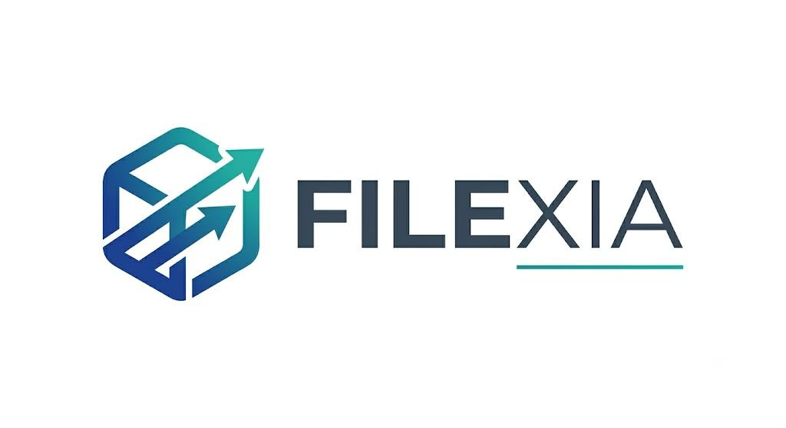

# Filexia



Filexia is a high-performance, user-friendly file ecosystem developed to meet modern file management, organization, and secure sharing needs. It simplifies complex directory structures while enabling you to manage your data securely, whether locally or over a network.

---

## Key Features

| Function | Description | Benefit |
| :--- | :--- | :--- |
| **High Performance** | Organize large-scale files and data blocks with minimal resource consumption. | Low Latency |
| **Advanced Filtering** | Smart search based on file type, size, or custom metadata tags. | Time Savings |
| **Secure Transfer** | Encrypted and traceable transfer mechanisms that preserve data integrity. | End-to-End Security |
| **Cross-Platform** | A seamless experience on every platform, thanks to both its developer-friendly structure and simple interface. | Flexible Usage |

---

## System Architecture and Data Flow

[ User Interface ] │

▼

[ File Processing Center ] ──► [ Smart Filtering / Indexing ] │

▼

[ Encryption Layer ] ──► [ Secure Storage & Transfer ]


---

## Core Technologies

* **Frontend:** Modern and performance-focused UI components.
* **Backend:** Modular, extensible, and performance-tested server architecture.
* **Data Management:** Secure data indexing and fast querying infrastructure.

---

## Installation and Getting Started

Follow the steps below to set up the project in a local environment.

### Requirements
* Relevant development environment dependencies (package manager and runtime environment)

### Running the Application

```bash
# Clone the project
git clone [https://github.com/kullaniciadi/filexia.git](https://github.com/kullaniciadi/filexia.git)

# Go to the project directory
cd filexia

# Install dependencies
npm install # or the corresponding package manager command

# Start the application
npm start
```
## License

This project is licensed under the MIT License. For details, see the `LICENSE` file.


Translated with DeepL.com (free version)
